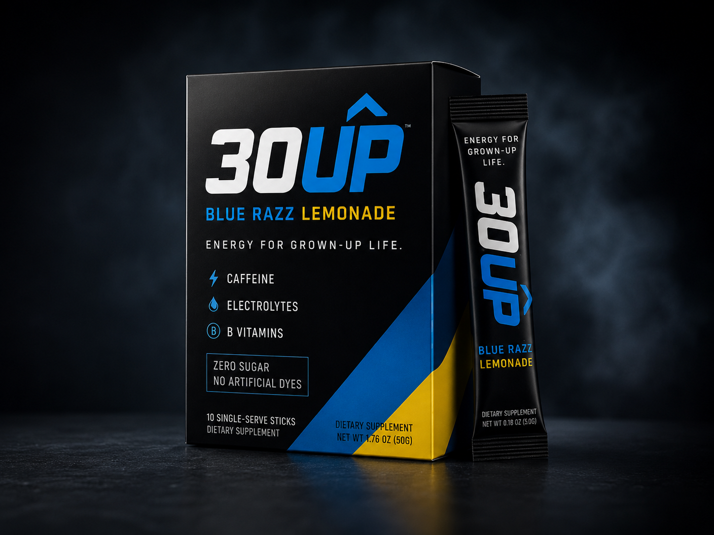
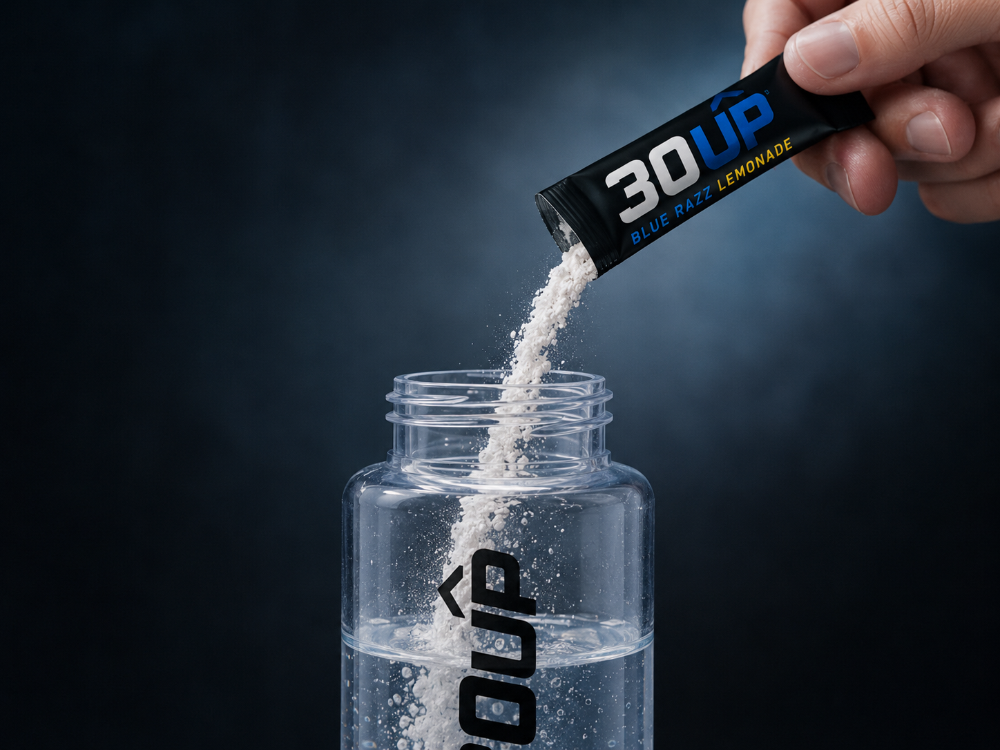
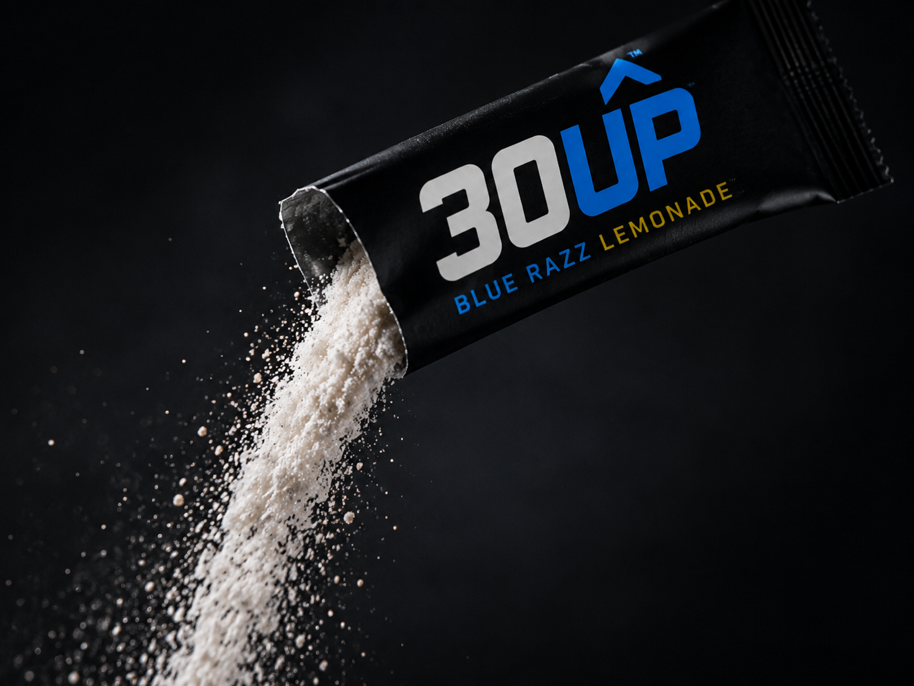

<div align="center">


# 30Up — Energy for Grown-Up Life

A modern, responsive launch & waitlist site for **30Up**, a powdered energy
drink mix for adults 30+. First flavor: **Blue Razz Lemonade**.

Built with **Vue 3 · Vite · TypeScript · Tailwind CSS · Firebase**

</div>

---

<div align="center">

</div>

## ✨ Highlights

- **Premium, brand-matched design** — near-black charcoal, electric blue, and gold,
  styled directly from the 30Up packaging.
- **Single-page responsive landing** — hero, problem, product, audience, a
  full-bleed lifestyle band, planned-formula, waitlist, founder, and an
  accessible FAQ accordion.
- **Waitlist → Firestore** — real submissions with validation and loading/error states.
- **Accounts** — email/password **plus Google** sign-in (Firebase Auth).
- **Protected dashboard** (`/account`) — profile, first-batch status, and an
  order/transaction-history area ready for launch.
- **Custom UI components** — a fully keyboard-accessible dropdown (`BaseSelect`)
  replaces native `<select>`s, plus an ARIA accordion.

## 🚀 Getting started

```bash
npm install
npm run dev
```

Open the URL Vite prints (default http://localhost:5173).

```bash
npm run build     # type-check + production build → dist/
npm run preview   # preview the production build
```

## 🔥 Firebase setup

This project uses Firebase (Firestore + Auth) for project **`up-3fcd5`**.

1. **Register a Web app** (Project settings → General → `</>`).
2. **Create `.env`** from `.env.example` and add `VITE_FIREBASE_API_KEY` and
   `VITE_FIREBASE_APP_ID`. `.env` is git-ignored; Firebase web config values are
   not secrets — Firestore Security Rules control access.
3. **Enable Firestore**, then **publish the rules** in [`firestore.rules`](firestore.rules)
   (Firestore → Rules → paste → Publish). Until you do, writes are denied.
4. **Enable sign-in providers** (Authentication → Sign-in method):
   Email/Password and Google.

## 📸 The product

<table>
  <tr>
    <td width="50%"></td>
    <td width="50%"></td>
  </tr>
  <tr>
    <td width="50%"></td>
    <td width="50%"></td>
  </tr>
</table>

## 🗂 Project structure

```
index.html              # SEO + Open Graph/Twitter meta, favicon
public/                 # og-image.png (social share)
src/
  main.ts               # App bootstrap + router
  App.vue               # Header + <RouterView> + Footer shell
  firebase.ts           # Firebase init (Firestore, Auth, Analytics)
  style.css             # Tailwind layers + design tokens
  composables/
    useAuth.ts          # App-wide auth state + email/Google helpers
  router/
    index.ts            # Routes + auth guard + hash scroll
  views/
    HomeView.vue        # Landing page (all sections)
    AuthView.vue        # Login / signup (+ Google)
    AccountView.vue     # Protected dashboard + order-history placeholder
  components/
    SiteHeader.vue  SiteFooter.vue
    HeroSection.vue  ProblemSection.vue  ProductSection.vue
    AudienceSection.vue  LifestyleBand.vue  FormulaSection.vue
    WaitlistSection.vue  FounderSection.vue  FaqSection.vue
    BaseSelect.vue      # Custom accessible dropdown
  photos/               # Brand photography + logo
firestore.rules         # Waitlist security rules
.env.example            # Firebase config template
```

## ⚠️ Disclaimer

30Up is in development. Product names, formulas, packaging, claims, caffeine
levels, ingredients, and availability are subject to change. This site is for
early interest and product validation only.
